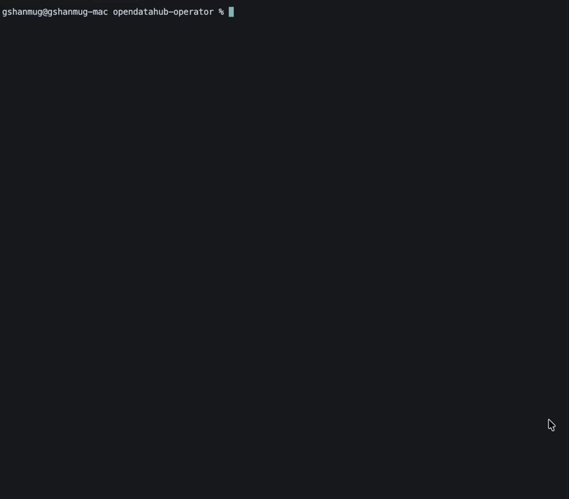
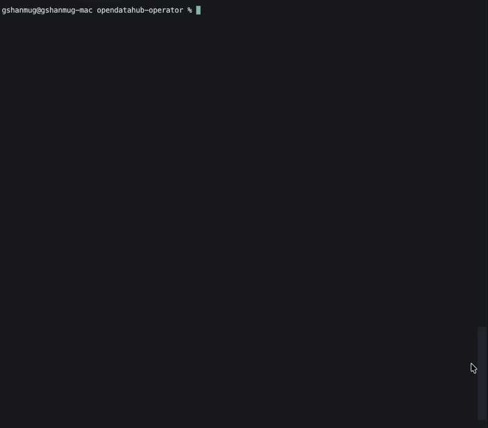

# Keycloak AWS EC2 Management Script

Script for managing Keycloak instances on AWS EC2.

## Usage

```bash
chmod +x keycloak-aws.sh
./keycloak-aws.sh
```

## Video Demonstrations

### Create Keycloak Instance


### Delete Keycloak Instance

